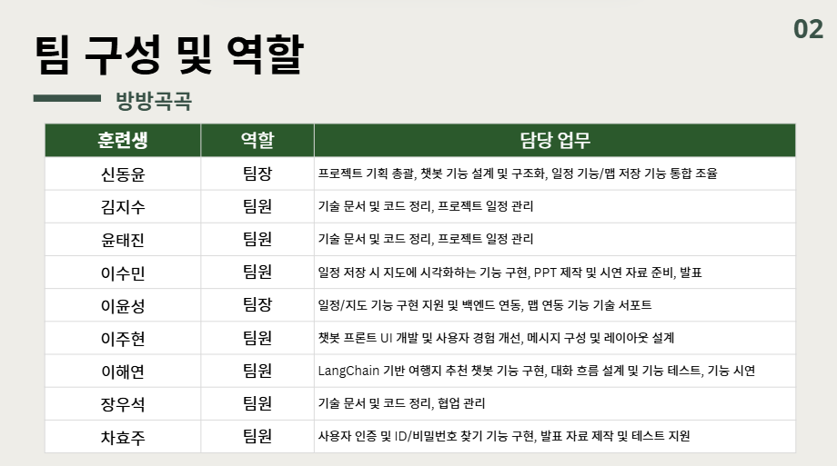

# 🗺️ 방방곡곡 – AI 기반 여행 일정 플래너

> AI와 지도를 활용한 스마트 여행 일정 추천/관리 웹 애플리케이션  
> (Django 기반, OpenAI GPT-4o-mini 연동)

---

## ✨ 프로젝트 개요

방방곡곡는 **AI 기반 여행 계획 챗봇 웹 애플리케이션**입니다.  
사용자가 여행 일정, 맛집, 브이로그 등을 요청하면 AI가 답변하고,  
일정을 저장하고 지도에 표시하는 기능을 제공합니다.

---

## 🏗️ 프로젝트 구조

```bash
pj3/
├── config/                  # Django 설정
├── chatbot/                 # 챗봇 앱 (핵심 기능)
│   ├── models.py            # 데이터베이스 모델
│   ├── views.py             # 뷰 로직
│   ├── services/            # 챗봇 처리 로직
│   ├── utils/               # 유틸리티 함수
│   ├── static/              # CSS, JS, 이미지
│   └── templates/           # HTML 템플릿
├── screenshots/             # 프로젝트 스크린샷
├── .env                     # 실제 환경변수 (GitHub에 올리지 않음)
├── .env.example             # 환경변수 예시 파일 (GitHub에 올림)
├── .gitignore               # GitHub 업로드 제외 규칙
├── db.sqlite3               # SQLite 데이터베이스
└── requirements.txt         # 패키지 의존성

---

## 🤖 핵심 기능

### 1. 챗봇 기능

* OpenAI GPT-4o-mini 기반 대화
* 일정 추천 / 브이로그 검색 / 간단한 Q\&A / 여행 정보
* 세션 기반 대화 관리 (히스토리 저장)

### 2. 지도 기능

* 카카오맵 JavaScript API 연동
* 장소명 → 위도/경도 자동 변환
* 마커 & 경로 표시 (카카오 내비 + Google Directions API)
* 일정 장소 시각화

### 3. 사용자 관리

* 회원가입/로그인 (Django 기본 인증)
* 사용자 프로필 관리 (이름, 전화번호)
* 계정 찾기 기능

### 4. 일정 관리

* AI 기반 일정 생성 (JSON 구조)
* 사용자별 일정 DB 저장/불러오기
* 지도와 연동된 일정 확인

---

## 🔧 기술 스택

### Backend

* Django 5.2.5
* SQLite (→ PostgreSQL 고려 가능)
* LangChain
* OpenAI GPT-4o-mini
* Google APIs (Places, Directions)
* YouTube API

### Frontend

* JavaScript (1100+ LOC)
* 카카오맵 JavaScript API
* Bootstrap
* CSS Grid / Flexbox
* AJAX 기반 실시간 통신

---

## 💾 데이터베이스 모델

```python
ChatSession   # 대화 세션
ChatMessage   # 개별 메시지
Schedule      # 여행 일정 (JSON)
Place         # 장소 정보 (좌표 포함)
UserProfile   # 사용자 프로필
```

---

## 🎨 UI/UX 특징

* 데스크톱/모바일 반응형 지원
* 실시간 메신저형 채팅 인터페이스
* 사이드바: 과거 대화 및 일정 관리
* 지도 통합 (채팅창 내 일정 확인 가능)
* 버튼 상태 동적 제어 (일정 저장/지도 보기)

---

## ⚡ 고급 기능

* 세션 기반 컨텍스트 추적
* AI 응답 → 장소명 추출 → 좌표 검색 자동화
* 일정 수정 요청 자동 감지
* 다중 교통수단 경로 지원
* 세션 스토리지 임시 데이터 관리
* 견고한 예외 처리 및 오류 대응

---

## 📊 코드 품질

* MVC 패턴 준수, 모듈화된 구조
* 한국어 주석이 풍부하여 이해 용이
* 확장성 높은 아키텍처
* CSRF 토큰 등 보안 고려

---

## 🚀 개선 제안

1. **환경 변수 분리**: API 키를 `.env` 파일로 관리
2. **캐싱 시스템**: Redis 등으로 응답 속도 향상
3. **테스트 코드**: 유닛 테스트 도입
4. **로깅 시스템**: 체계적인 로그 관리
5. **DB 업그레이드**: SQLite → PostgreSQL

---

## 🔑 환경변수 설정 방법

1. 프로젝트 루트에 `.env` 파일을 생성하세요.
2. 아래와 같은 변수를 추가하고, 실제 발급받은 API 키를 입력합니다.

```bash
# OpenAI
OPENAI_API_KEY=your_openai_key_here

# Google API
GOOGLE_API_KEY=your_google_key_here

# Kakao
KAKAO_REST_API_KEY=your_kakao_rest_key_here
KAKAO_JS_API_KEY=your_kakao_javascript_key_here

# YouTube
YOUTUBE_API_KEY=your_youtube_key_here

# Django Secret Key
DJANGO_SECRET_KEY=your_django_secret_here

# SerpAPI
SERP_API_KEY=your_serp_key_here
```

3. 팀원 공유용으로는 `.env.example` 파일을 참고하세요.

```bash
OPENAI_API_KEY=
GOOGLE_API_KEY=

KAKAO_REST_API_KEY=
KAKAO_JS_API_KEY=

YOUTUBE_API_KEY=
DJANGO_SECRET_KEY=
SERP_API_KEY=
```

4. `.env` 파일은 반드시 `.gitignore`에 등록하여 GitHub에 올리지 마세요.

```gitignore
# Env files
.env
*.env
```

---

## 📸 시연 화면

### 1) 메인 채팅 화면


### 2) 일정 추천 결과


### 3) 지도 시각화


### 4) 로그인/회원가입


### 5) 팀구성



---

## 👥 팀 정보

* 팀장: 신동윤
* 팀원: 김지수, 윤태진, 이수민, 이윤성, 이주현, 이해연, 장우석, 차효주

---

## ▶ 실행 방법

1. 저장소 클론

```bash
git clone https://github.com/your-repo-name.git
cd pj3
```

2. 가상환경 생성 및 활성화

```bash
python -m venv venv
source venv/bin/activate   # Mac/Linux
venv\Scripts\activate      # Windows
```

3. 패키지 설치

```bash
pip install -r requirements.txt
```

4. 환경변수(.env) 설정 → `.env.example` 참고하여 `.env` 생성 후 키 입력

5. DB 마이그레이션

```bash
python manage.py migrate
```

6. 서버 실행

```bash
python manage.py runserver
```

7. 브라우저에서 접속

```
http://127.0.0.1:8000/
```

---

## 👤 샘플 계정 (테스트용)

발표/시연을 위한 테스트 계정:

```
아이디: admin
이메일: (생략 가능)
비밀번호: admin
```
